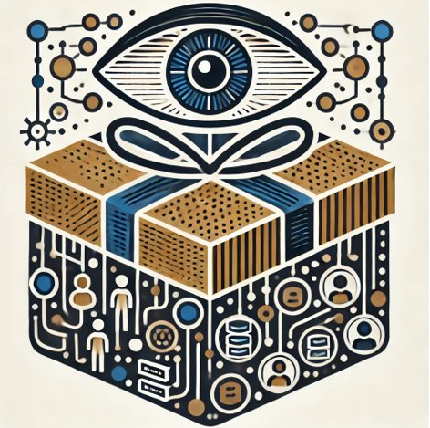
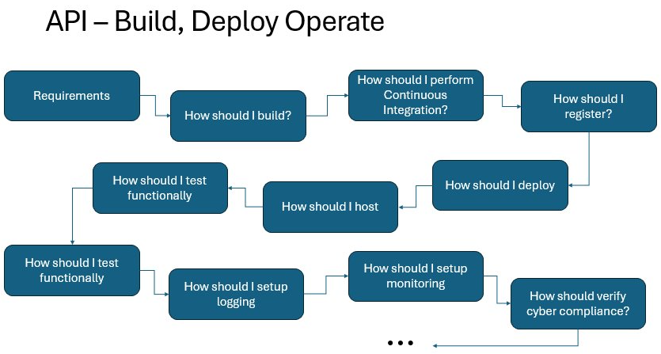

# Giftrails - Guardrails as gifts and not sticks

    

Giftrails is a concept which aims to improve developer experience in building APIs and provide a mechanism for better collaboration at the enterprise level, for teams owning cross-functional capabilities such as logging, authentication, authorisation, resilience, monitoring.

The topic was presented at the API Days in Melbourne in Oct 2024

    

The outcome is to encourage delivery of compliant APIs, but it also proposes to have a migration design from the start, such that when the new API framework or startegy is in place it does not take years for migration to complete.

This codebase is a skeleton template, to be used as is or customised. Not one enterprise is the same as another, so the folders/modules within the Giftrails codebase should be a reflection of the capabilities required to build an API in the Enterprise.

    

Its not always obvious how these all fit together in big enterprises, as different people and roles might be performing them. Getting an Enterprise Architect (or an Engineer doing it all in smaller companies) to map the E2E process and keep it relevant as process or capabilites change will help paint the picture of how hard or easy it is to create an API.

# Single Command

Engineers are the customers here, and to make it as easy as possible for them to get started and focus on their business domain, try to keep it within a single command

Example for Java

    mvn archetype:generate -DgroupId=com.enterprise.apiplatform -DartifactId=api-giftrails-java -DarchetypeArtifactId=<<apiname>> -DarchetypeVersion=1.4 -DinteractiveMode=false

Example for dotnet

    dotnet new giftrails-pattern-1 -n <<apiname>>

That ease will ensure they are more likely to follow the guardrails, and not by-pass them because of delivery pressure.

# The Community

To make this successful, the most important aspect is the community that will 
- contribute towards building the giftrails modules; e.g logging-toolkit, security toolkit, etc..
- continuously improve based on dev and pro experiences; such as defects and incidents
- suggest features that will contribute to better experience, performance and security

